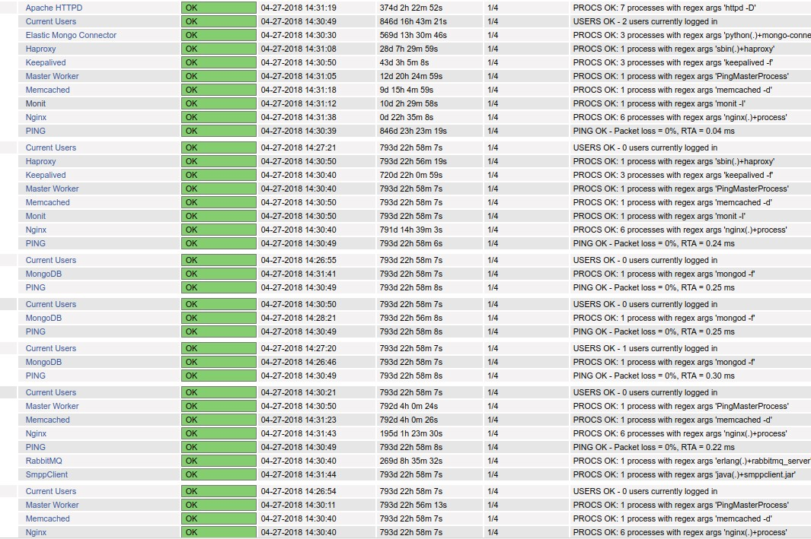

# Nagios-core-4x on CentOS 7

Một số nội dung về Nagios-core-4x, gồm:

- [Một số thành phần trong Nagios](docs/1.about-nagios-core.md)

- [Hướng dẫn cài đặt Naigos-core](docs/2.install-nagios-core-4x.md)

- [Hướng dẫn cài đặt Nagios Linux client](docs/3.install-linux-client.md)

- [Send alert via email - telegram](docs/4.send-alert-via-email-telegram.md)

- [Giám sát thiết bị mạng](docs/5.monitoring-network-devices.md)

- [Giám sát VMWare](docs/6.monitoring-vmware.md)

- [Generate performance graphs with Nagios graph](docs/7.nagiosgraph.md)

- [Generate performance graphs with PNP4Nagios](docs/8.pnp4nagios.md)

- [Giám sát với một số plugins khác](monitoring-with-extended-plugins.md)

- [Một số mẫu tệp cấu hình](./etc)

Updating ...
