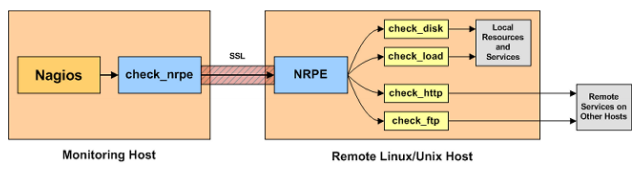

# Một số thành phần trong hệ thống Nagios

https://www.nagios.org/downloads/nagios-core-addons/

## 1. Nagios core

Nagios core là một ứng dụng nguồn mở dùng để giám sát hệ thống, mạng

Một số tính năng của Nagios core:

- Giám sát network service như SMTP, POP3, HTTP, PING, ..

- Giám sát tài nguyên máy như CPU, RAM, DISK, ..

- Cho phép người dùng dễ dàng phát triển các plugin check service

- Quá trình check các service được thực hiện song song

- Cho phép tìm và phân biệt được giữa các hosts down và unreachable

- Thông báo khi service hoặc host có vấn đề ( có thể thực hiện thông báo qua email, sms, ..)

- Tự động thực hiện rotate các tệp log

- Hỗ trợ triển khai Naigos server dự phòng

- Hỗ trợ giao diện web cho xem trạng thái hiện tại về network, notification, history, log file, ...

## 2. Nagios Remote Plugin Executor (NRPE)

NRPE là addon mà được thiết kế để cho phép thực thi Nagios plugins trên máy linux từ xa (Linux/Unix). Nó cho phép Nagios để giám sát các tài nguyên local trên các máy từ xa như các thông tin về CPU, Memory, ..

Tài nguyên trên các máy thường không public cho bên ngoài, vì vậy chúng ta cần cài đặt agent NRPE trên máy Linux/Unix từ xa mà khi đó chỉ giới hạn cho phép truy cập từ Nagios server.

Ngoài ra, chúng ta cũng có thể  thực thi các Nagios plugins trên máy Linux/Unix từ xa qua SSH. Khi đó dùng plugin check_by_ssh. Sử dụng SSH bảo mật hơn NRPE addon, nhưng nó có thể chiếm một lượng lớn hơn về CPU trên cả Nagios server và client. Vấn đề này chỉ dễ nhận ra khi thực hiện giám sát một số lượng rất nhiều máy.

 

NRPE addon gồm 2 phần:

- Plugin check_nrpe nằm trên Nagios server.

- NRPE daemon chạy trên máy Linux/Unix từ xa

Khi Nagios server cần giám sát tài nguyên của service trên máy Linux/Unix từ xa, quá trình thực hiện gồm các bước sau:

- Step1: Nagios sẽ thực thi plugin check_nrpe và bảo service nào được check

- Step2: Plugin check_nrpe sẽ liên hệ NRPE daemon trên một máy từ xa qua ( Có thể tùy chọn qua một kết nối bảo mật SSL)

- Step3: NRPE daemon chạy một plugin Nagios phù hợp để check service hoặc tài nguyên

- Step4: Kết quả từ quá trình check service sẽ được truyền từ NRPE daemon trả lại plugin check_nrpe. Thông tin về kết quả check sẽ được gửi trở lại cho Nagios server.

## 3. Nagios Plugins

- Plugins cho phép giám sát một số hoặc mọi thứ với Nagios như databases, operating systems, applications, network equipment, protocols, ..

- Nagios plugins là package chứa hơn 50 plugins cơ bản cho phép giám sát hệ thống.

- Để giám sát một service ngoài gói 50 plugins có sẵn, người dùng có thể dễ dàng phát triển các plugin để check service hoặc download một số plugins có sẵn.

## 4. NagiosGraph

Nagiosgraph là một add-on cho Nagios.

Nagiosgraph thực hiện 02 việc sau:

- Thu thập dữ liệu hiệu suất từ Nagios plugins và lưu chúng vào các tệp RRD.

- Từ dữ liệu thu thập đó, sẽ thực hiện sinh ra các đô thị và các report trên môi trường web
