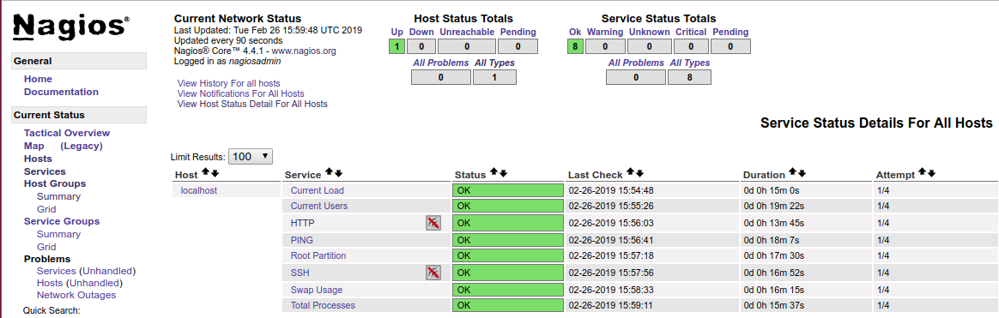

# Cài đặt và cấu hình Nagios server

## 1. Install Nagios Core 4 from source

**Step1**: Disable Selinux

```
setenforce 0
sed -i 's/SELINUX=.*/SELINUX=disabled/g' /etc/selinux/config
```

**Step2**: Cài đặt thư viện và các gói cần thiết liên quan

```
yum install -y gcc glibc glibc-common wget unzip httpd php gd gd-devel
yum groupinstall "Development Tools"
```

**Step3**: Downloading and installing the Nagios Source

- Create User And Group
This creates the nagios user and group. The apache user is also added to the nagios group.

```
useradd nagios
groupadd nagcmd
usermod -a -G nagcmd nagios
usermod -G nagcmd apache
```

- Downloading

```
cd /opt
wget -O nagioscore.tar.gz https://github.com/NagiosEnterprises/nagioscore/archive/nagios-4.3.4.tar.gz
tar xzf nagioscore.tar.gz
```

- Configure, compile & install binary

```
cd /opt/nagioscore-nagios-4.3.4/
./configure
make all
make install
```

**Step4**: Install Service / Daemon
This installs the service or daemon files and also configures them to start on boot. The Apache httpd service is also configured at this point.

```
make install-init
systemctl enable nagios.service
systemctl enable httpd.service
```

- Install Command Mode

This installs and configures the external command file.

`make install-commandmode`

- Install Configuration Files

This installs the *SAMPLE* configuration files. These are required as Nagios needs some configuration files to allow it to start.

`make install-config`

- Install Apache Config Files 

This installs the Apache web server configuration files. Also configure Apache settings if required.

`make install-webconf`

**Step5**: Cấu hình firewall

```
firewall-cmd --permanent --zone=public --add-port=80/tcp
firewall-cmd --reload
```

**Step6**: Tạo tài khoản quản trị login Nagios

Để login giao diện web Nagios, chúng ta sẽ tạo một tài khoản

`htpasswd -b -c /usr/local/nagios/etc/htpasswd.users nagiosadmin nagiosadmin`

Nếu muốn tạo thêm người dùng khác (không cần tham số -c)

`htpasswd /usr/local/nagios/etc/htpasswd.users keepwalking password`


**Step7**: Start Apache Web Server & Nagios

```
systemctl start httpd.service
systemctl start nagios.service
```

**Step8**: Test Nagios

Chúng ta truy cập giao diện web Nagios để xác minh Nagios đang hoạt động

`http://your-nagios-server-ip/nagios`

Vào thông tin login: nagiosadmin/nagiosadmin

<p align="center"> 

</p>

## 2. Cài đặt Nagios Plugin

**Step1**: Cài đặt các gói cần có

```
yum install -y gcc glibc glibc-common make gettext automake autoconf wget openssl-devel net-snmp net-snmp-utils epel-release
yum install -y perl-Net-SNMP
```

**Step2**: Download và cài đặt

Download nagios-plugins tại: [https://nagios-plugins.org/downloads/](https://nagios-plugins.org/downloads/)

```
cd /opt
wget --no-check-certificate -O nagios-plugins.tar.gz https://github.com/nagios-plugins/nagios-plugins/archive/release-2.2.1.tar.gz
tar zxf nagios-plugins.tar.gz
```

- Compile và Install

```
cd /opt/nagios-plugins-release-2.2.1/
./tools/setup
./configure
make
make install
```

##3. Cài đặt plugin check_nrpe

Để  giám sát nagios client là Linux/Unix qua check_nrpe, chúng ta cài NRPE addon.

Trong trường hợp này, chúng ta chỉ cài gói NRPE với phần plugin check_nrpe, mà không cần cài nrpe daemon.

**Step1**: Cài đặt các gói yêu cầu

`yum install -y gcc glibc glibc-common openssl openssl-devel perl wget`

**Step2**: Download NRPE

```
cd /opt
wget --no-check-certificate -O nrpe.tar.gz https://github.com/NagiosEnterprises/nrpe/archive/nrpe-3.2.1.tar.gz
tar zxvf nrpe.tar.gz
```

**Step3**: Compile & cài đặt

```
cd /opt/nrpe-nrpe-3.2.1/
./configure --enable-command-args
make all
```

**Note**: Nếu chúng ta muốn truyền các tham số commands qua NRPE, khi đó cần chỉ cần tùy chọn cấu hình `--enable-command-args` trong phần cài đặt NRPE.
Nếu không đặt tùy chọn này, khi đó để truyền tham số qua commands qua NRPE, cần khai báo riêng cho từng Nagios client được giám sát.

**Step4**: Tạo tệp tin cấu hình nrpe

`make install-config`
