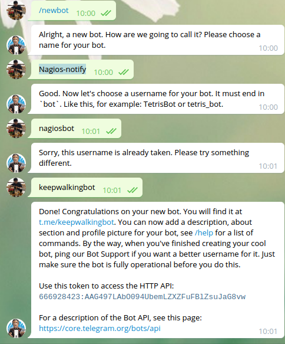
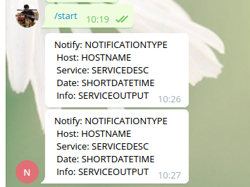

# Send Alert via Email - Telegram

# Table of contents

- [1. SEND ALERT VIA EMAIL](#email)
  - [1.1 Sử dụng mailx](#mailx)
  - [1.2 Sử dụng tool sendEmail](#sendEmail)
- [2. SEND AlERT VIA TELEGRAM](#telegram)
  - [2.1 Tạo Telegram Bot](#create-telgrambot)
  - [2.2 2.2 Download Telegram-notify php script](#download-telegram)
  - [2.3 Cấu hình Nagios để sử dụng telegram](#nagios-telegram)

=============================================================================

# <a name="email">1. SEND ALERT VIA EMAIL</a>

Mặc định ta có cấu hình như sau trong tệp "/usr/local/nagios/etc/object/contacts.cfg":

```
define contact{
    contact_name                    nagiosadmin             ; Short name of user
    use                             generic-contact         ; Inherit default values from generic-contact template (defined above)
    alias                           Nagios Admin            ; Full name of user
    email                           nagios@localhost<<***** CHANGE THIS TO YOUR EMAIL ADDRESS ******
}
define contactgroup{
    contactgroup_name       admins
    alias                   Nagios Administrators
    members                 nagiosadmin
}
```

Như vậy: Mỗi khi có cảnh báo, nagios sẽ gửi vào địa chỉ mail group là admins (có member: nagiosadmin)

Chúng ta thực hiện mail server của công ty để thực hiện gửi cảnh báo

## <a name="mailx">1.1 Sử dụng mailx</a>

- Cài đặt mailx

`yum install mailx`

- Sử dụng mailx cơ bản

`echo "Body of email" | mailx -r "FROM_EMAIL" -s "SUBJECT" "TO_EMAIL"`

Gửi mail với tệp đính kèm

`mailx -a file -s "SUBJECT" "TO_EMAIL"`

Gửi mail với thông tin SMTP server

`echo "Body of email" | mailx -r 'FROM-EMAIL' -s "SUBJECT" -S ssl-verify=ignore -S smtp-auth=login -S smtp=smtp://mail.example.com:25 -S from='info@example.com(INFO EXAMPLE)' -S smtp-auth-user='info@example.com' -S smtp-auth-password='Password' -S ssl-verify=ignore 'TO-EMAIL'`

Nếu sử dụng gmail thì, gửi mail như sau:

`mailx -s "SUBJECT" -S smtp-use-starttls -S ssl-verify=ignore -S smtp-auth=login -S smtp=smtp://smtp.gmail.com:587 -S from="FROM-EMAIL(FRIENDLY_NAME)" -S smtp-auth-user="FROM-EMAIL" -S smtp-auth-password="Password" -S ssl-verify=ignore "TO-EMAIL"`

>-s   = Chỉ định chủ đề email
-r   = Chỉ định email gửi (Hoặc -S from=info@example.com)
-S   = Khai báo thông tin SMTP
-a   = Chỉ định đường dẫn tệp attach

- Sử dụng mailx cho gửi email thông báo

Sửa nội dung tệp cấu hình /usr/local/nagios/etc/objects/commands.cfg

```
#'notify-host-by-email' command definition
define command{
        command_name    notify-host-by-email
        command_line /usr/bin/printf "%b" "***** Nagios *****\n\nNotification Type: $NOTIFICATIONTYPE$\n\nHost: $HOSTNAME$\nState: $HOSTSTATE$\nAddress: $HOSTADDRESS$\nInfo: $HOSTOUTPUT$\nComment: $HOSTACKCOMMENT$\n\nDate/Time: $LONGDATETIME$\n" | /bin/mailx -r 'info@example.com' -S ssl-verify=ignore -S smtp-auth=login -S smtp=smtp://mail.example.com:25 -S from='info@example.com' -S smtp-auth-user='info@example.com' -S smtp-auth-password='Password' -S ssl-verify=ignore 'receiver@example.com' -s "[$NOTIFICATIONTYPE$][HOST] $HOSTNAME$ is $HOSTSTATE$"
        }

#'notify-service-by-email' command definition
define command{
         command_name notify-service-by-email
         command_line /usr/bin/printf "%b" "***** Nagios *****\n\nNotification Type: $NOTIFICATIONTYPE$\n\nService: $SERVICEDISPLAYNAME$\nHost: $HOSTNAME$\nAddress: $HOSTADDRESS$\nState: $SERVICESTATE$\nComment: $SERVICEACKCOMMENT$\n\nDate/Time: $LONGDATETIME$\n\nAdditional Info:\n\n$SERVICEOUTPUT$\n" |  /bin/mailx -r 'info@example.com' -S ssl-verify=ignore -S smtp-auth=login -S smtp=smtp://mail.example.com:25 -S from='info@example.com' -S smtp-auth-user='info@example.com' -S smtp-auth-password='Password' -S ssl-verify=ignore 'receiver@example.com' -s "[$NOTIFICATIONTYPE$][$HOSTNAME$] $SERVICEDISPLAYNAME$ is $SERVICESTATE$"
}
```

## <a name="sendEmail">1.2 Sử dụng tool sendEmail</a>

**Step1**: Download sendMail

```
wget http://caspian.dotconf.net/menu/Software/SendEmail/sendEmail-v1.56.tar.gz
tar -zxvf sendEmail-v1.56.tar.gz
cp sendEmail-v1.56/sendEmail /usr/local/bin/sendEmail
```

**Step2**: Định nghĩa command để thông báo email

Sửa nội dung tệp cấu hình /usr/local/nagios/etc/objects/commands.cfg

```
#'notify-host-by-email' command definition
define command{
        command_name    notify-host-by-email
        command_line /usr/bin/printf "%b" "***** Nagios *****\n\nNotification Type: $NOTIFICATIONTYPE$\n\nHost: $HOSTNAME$\nState: $HOSTSTATE$\nAddress: $HOSTADDRESS$\nInfo: $HOSTOUTPUT$\nComment: $HOSTACKCOMMENT$\n\nDate/Time: $LONGDATETIME$\n" | /usr/local/bin/sendEmail -f info@example.com -t $CONTACTEMAIL$ -s mail.example.com:25 -xu info@example.com -xp "Password" -l /var/log/sendEmail -u "[$NOTIFICATIONTYPE$][HOST] $HOSTNAME$ is $HOSTSTATE$"
        }

#'notify-service-by-email' command definition
define command{
         command_name notify-service-by-email
         command_line /usr/bin/printf "%b" "***** Nagios *****\n\nNotification Type: $NOTIFICATIONTYPE$\n\nService: $SERVICEDISPLAYNAME$\nHost: $HOSTNAME$\nAddress: $HOSTADDRESS$\nState:     $SERVICESTATE$\nComment: $SERVICEACKCOMMENT$\n\nDate/Time: $LONGDATETIME$\n\nAdditional Info:\n\n$SERVICEOUTPUT$\n" |  /usr/local/bin/sendEmail -f info@example.com -t $CONTACTEMAIL$ -s mail.example.com:25 -xu info@example.com -xp "Password" -l /var/log/sendEmail.log -u "[$NOTIFICATIONTYPE$][$HOSTNAME$] $SERVICEDISPLAYNAME$ is $SERVICESTATE$"
}
```

# 2. SEND ALERT VIA TELEGRAM

## <a name="create-telegrambot">2.1 Tạo Telegram Bot</a>

Sử dụng tài khoản telegram, sau đó tìm @BotFather.

Thực hiện tạo bot như sau:

- Gõ lệnh /newbot

- Định nghĩa tên cho bot, ví dụ: Nagios-notify

- Định nghĩa username cho bot (kết thúc username là bot, hoặc _bot), ví dụ: keepwalkingbot

Sau khi kết thúc việc tạo username cho bot, thì @BotFather sẽ thông báo việc tạo thành công và gửi  token cho việc truy cập HTTP API.

test-message-bottest-message-bot<p align="center"> 

</p>

- Tìm và add bot @keepwalkingbot vào contact của người sẽ nhận notify (ví dụ tôi dùng tài khoản telegram của tôi là @keepwalking86)

- Xác định giá trị chat_id

Đầu tiên, người dùng mà  sẽ cần gửi message /my_id đến bot (@keepwalkingbot)

Sau đó vào đường dẫn URL sau: **https://api.telegram.org/bot_token/getUpdates**

Vào giá trị `token` mà chúng ta đã có ở trên: `666928423:AAG497LAbO094UbemLZXZFuFBlZsuJaG8vw`

Chúng ta sẽ truy cập URL như sau:

https://api.telegram.org/bot666928423:AAG497LAbO094UbemLZXZFuFBlZsuJaG8vw/getUpdates

Khi đó tôi nhận được giá trị ID như cho @keepwalking86 là: "id":688042558

Chúng ta sẽ sử dụng giá trị ID "688042558" để định nghĩa phần contact của Nagios

## <a name="download-telegram">2.2 Download Telegram-notify php script</a>

- Download tại: [telegram-notify.zip](https://exchange.nagios.org/components/com_mtree/attachment.php?link_id=7344&cf_id=24)

- Giải nén vào thư mục /usr/local/nagios/sbin

- Phân quyền

```
chown nagios:nagios -R /usr/local/nagios/sbin/telegram-notify/log/ 
chmod 775 -R /usr/local/nagios/sbin/telegram-notify/log/ 
chown root:root /usr/local/nagios/sbin/telegram-notify/log/.htaccess 
```

- Kiểm tra gửi message bằng command

php /usr/local/nagios/sbin/telegram-notify/telegram-bot.php "688042558" "666928423:AAG497LAbO094UbemLZXZFuFBlZsuJaG8vw" 1 "Notify: NOTIFICATIONTYPE 0XzXZ0 Host: HOSTNAME 0XzXZ0 Service: SERVICEDESC 0XzXZ0 Date: SHORTDATETIME 0XzXZ0 Info: SERVICEOUTPUT"

Trong đó: 

688042558: là Telegram ID của tôi (@keepwalking86) là người sẽ nhận message

666928423:AAG497LAbO094UbemLZXZFuFBlZsuJaG8vw: Là token key của @keepwalkingbot nhận được ở trên

Kết quả thực hiện test:

<p align="center">

</p>

## <a name="nagios-telegram">2.3 Cấu hình Nagios để sử dụng telegram</a>

**Step1**: Định nghĩa command telegram

Thực hiện định nghĩa command telegram cho host, service. Thêm nội dung sau vào tệp /usr/local/nagios/etc/objects/command.cfg

```
# 'notify-service-telegram' command definition
define command{
        command_name    notify-service-telegram
        command_line    /usr/bin/php /usr/local/nagios/sbin/telegram-notify/telegram-bot.php "688042558" "666928423:AAG497LAbO094UbemLZXZFuFBlZsuJaG8vw" 1 "Notify: $NOTIFICATIONTYPE$ 0XzXZ0 Host: $HOSTNAME$ 0XzXZ0 Service: $SERVICEDESC$ 0XzXZ0 Date: $SHORTDATETIME$ 0XzXZ0 Info: $SERVICEOUTPUT$"
}
# 'notify-host-telegram' command definition 
define command{
        command_name    notify-host-telegram
        command_line    /usr/bin/php /usr/local/nagios/sbin/telegram-notify/telegram-bot.php "688042558" "666928423:AAG497LAbO094UbemLZXZFuFBlZsuJaG8vw" 1 "Notify: $NOTIFICATIONTYPE$ 0XzXZ0 Host: $HOSTNAME$ 0XzXZ0 Date: $SHORTDATETIME$ 0XzXZ0 Info: $HOSTOUTPUT$"
}
```

Trong đó:

- Telegram-bot: @keepwalkingbot

- 0XzXZ0 – line break character

- 688042558: Telegram ID người nhận message; Nếu có nhiều Telegram users nhận message, chúng ta thay giá ID với biến “”$_CONTACTTELEGRAM$” . Chúng ta sẽ khai báo giá trị “$_CONTACTTELEGRAM$” gồm nhiều telegram id.

- 666928423:AAG497LAbO094UbemLZXZFuFBlZsuJaG8vw: Token key của bot

**Step2**: Định nghĩa contact nhận message

Thêm nội dung sau vào tệp "/usr/local/nagios/etc/objects/contact.cg"

```
#Define contact for only Telegram
define contact{
        contact_name                    telegram                ; Short name of user
        use                             generic-contact         ; Inherit default values from generic-contact template (defined above)
        alias                           telegram Admin          ; Full name of user
        _telegram                       688042558 #Ở đây ta có thêm nhiều contact nhận message
        service_notifications_enabled   1
        host_notifications_enabled      1
        host_notification_commands      notify-host-telegram
        service_notification_commands   notify-service-telegram
        service_notification_period     24x7
        host_notification_period        24x7
        service_notification_options    c,w,r
        host_notification_options       d,u,r
        }
define contactgroup{
        contactgroup_name       admins		; Short name of user
        alias                   Nagios Administrators
        members                 admin,telegram		; Add membems to group
        }
```
