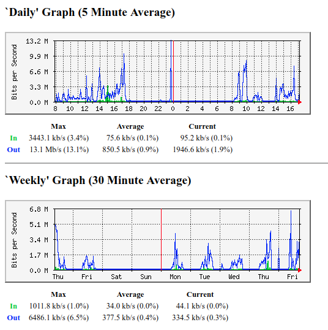

# Giám sát thiết bị mạng (Network devices)

Chúng ta thực hiện giám sát thiết bị mạng trạng thái uptime, load, memory và show băng thông mạng qua đồ thị

## 1. Trên thiết bị mạng

Chúng ta giám sát các thiết bị mạng dựa trên giao thức SNMP, vì vậy cần enable SNMP trên các thiết bị mạng để Nagios có thể monitor thông qua nó.

**Step1**: enable snmp

Dưới đây là cách enable và cấu hình cơ bản một số thiết bị mang phổ biến bằng giao diện command line.


- Thiết bị Cisco

`(config)#snmp-server community ten_community RO`

- Thiết bị HP

```
(config)#snmp-server enable
(config)#snmp-server community ten_community operator restricted
```

- Thiết bị Juniper

```
>set snmp community ten_community authorization read-only
>set description "Juniper Network"
```

Cụ thể trong bài này, mình sẽ đi vào giám sát thiết bị switch Cisco catalyst 2960, có địa chỉ IP là 192.168.10.254.

Thực hiện enable SNMP như sau:

```
switch2960>en
switch2960#conf t
(config)#snmp-server enable traps
(config)#snmp-server community public ro
(config)#snmp-server host 192.168.10.111 version 2c public
(config)#exit
Switch2960#show snmp
Swtich2960#copy running-config startup-config
(config)#end
```

Ở đây, tôi thao tác trên switch cisco 2960, với một số thông tin set như sau:

- Tên community là "public"

- set quyền `ro` = Read Only

- Set chỉ có server nagios (192.168.10.111) có thể truy cập đọc thông tin SNMP qua 

**Step2**: Check connected ports

```
switch2960#show interfaces status
Port      Name               Status       Vlan       Duplex  Speed Type
Fa0/1                        connected    10         a-full  a-100 10/100BaseTX
Fa0/2                        connected    10         a-full  a-100 10/100BaseTX
Fa0/3                        connected    10         a-full  a-100 10/100BaseTX
Fa0/4                        connected    10         a-full  a-100 10/100BaseTX
Fa0/5                        notconnect   10           auto   auto 10/100BaseTX
Fa0/6                        notconnect   10           auto   auto 10/100BaseTX
Fa0/7                        notconnect   10           auto   auto 10/100BaseTX
Fa0/8                        notconnect   10           auto   auto 10/100BaseTX
Fa0/9                        connected    20         a-full  a-100 10/100BaseTX
Fa0/10                       connected    20         a-full  a-100 10/100BaseTX
Fa0/11                       connected    20         a-full  a-100 10/100BaseTX
Fa0/12                       connected    20         a-full  a-100 10/100BaseTX
Fa0/13                       connected    20         a-full  a-100 10/100BaseTX
Fa0/14                       connected    20         a-full  a-100 10/100BaseTX
Fa0/15                       connected    20         a-full  a-100 10/100BaseTX
Fa0/16                       notconnect   20           auto   auto 10/100BaseTX
Fa0/17                       notconnect   10           auto   auto 10/100BaseTX
Fa0/18                       notconnect   10           auto   auto 10/100BaseTX
Fa0/19                       notconnect   10           auto   auto 10/100BaseTX
Fa0/20                       notconnect   10           auto   auto 10/100BaseTX
Fa0/21                       notconnect   40           auto   auto 10/100BaseTX
Fa0/22                       notconnect   40           auto   auto 10/100BaseTX
Fa0/23                       notconnect   1            auto   auto 10/100BaseTX
Fa0/24                       notconnect   1            auto   auto 10/100BaseTX
Gi0/1                        connected    trunk      a-full a-1000 10/100/1000BaseTX
Gi0/2                        notconnect   1            auto   auto Not Present
```

=> Ở đây show ra các port mà connected là F0/1-4,9-15 và port G0/1

## 2. Trên Nagios Server

**Step1**: Cài đặt snmp và một số utils

- Thực hiện cài đặt trên Nagios Server là CentOS

```
yum -y install net-snmp net-snmp-utils
yum -y install nagios-plugins-snmp.x86_64
cp /usr/lib64/nagios/plugins/check_snmp /usr/local/nagios/libexec/
```

- Check snmp với tool snmpwalk

Cho rằng Switch có địa chỉ IP là 192.168.10.254

`snmpwalk -v 2c -c public 192.168.10.254`

```
SNMPv2-MIB::sysDescr.0 = STRING: Cisco IOS Software, C2960 Software (C2960-LANLITEK9-M), Ver
sion 12.2(55)SE7, RELEASE SOFTWARE (fc1)
Technical Support: http://www.cisco.com/techsupport
Copyright (c) 1986-2013 by Cisco Systems, Inc.
Compiled Mon 28-Jan-13 10:22 by prod_rel_team
SNMPv2-MIB::sysObjectID.0 = OID: SNMPv2-SMI::enterprises.9.1.928
DISMAN-EVENT-MIB::sysUpTimeInstance = Timeticks: (149549490) 17 days, 7:24:54.90
SNMPv2-MIB::sysContact.0 = STRING: 
SNMPv2-MIB::sysName.0 = STRING: SW1.ditech.vn
SNMPv2-MIB::sysLocation.0 = STRING: 
SNMPv2-MIB::sysServices.0 = INTEGER: 2
SNMPv2-MIB::sysORLastChange.0 = Timeticks: (0) 0:00:00.00
SNMPv2-MIB::sysORID.1 = OID: SNMPv2-SMI::enterprises.9.7.129
SNMPv2-MIB::sysORID.2 = OID: SNMPv2-SMI::enterprises.9.7.115
SNMPv2-MIB::sysORID.3 = OID: SNMPv2-SMI::enterprises.9.7.265
SNMPv2-MIB::sysORID.4 = OID: SNMPv2-SMI::enterprises.9.7.112
SNMPv2-MIB::sysORID.5 = OID: SNMPv2-SMI::enterprises.9.7.106
SNMPv2-MIB::sysORID.6 = OID: SNMPv2-SMI::enterprises.9.7.47
SNMPv2-MIB::sysORID.7 = OID: SNMPv2-SMI::enterprises.9.7.122
SNMPv2-MIB::sysORID.8 = OID: SNMPv2-SMI::enterprises.9.7.135
SNMPv2-MIB::sysORID.9 = OID: SNMPv2-SMI::enterprises.9.7.43
SNMPv2-MIB::sysORID.10 = OID: SNMPv2-SMI::enterprises.9.7.37
SNMPv2-MIB::sysORID.11 = OID: SNMPv2-SMI::enterprises.9.7.92
SNMPv2-MIB::sysORID.12 = OID: SNMPv2-SMI::enterprises.9.7.53
SNMPv2-MIB::sysORID.13 = OID: SNMPv2-SMI::enterprises.9.7.54
SNMPv2-MIB::sysORID.14 = OID: SNMPv2-SMI::enterprises.9.7.52
```
Chúng ta có thể thực hiện check snmpwalk và lưu các thông tin network devices như interface up, OID, ...

Thực hiện như sau:

`snmpwalk -v 2c -c public 192.168.10.254 >OID.txt`

Khi đó, chúng ta có thể tìm thông tin về OID và interface trong tệp tin **OID.txt** đó

**Step2**: Thực hiện kiểm tra memory, cpu của thiết bị mạng

Chúng ta sẽ thu thập thông tin về Memory, CPU của thiết bị mạng dựa vào giá trị ping,  OID (Object Identifiers).

Tùy vào từng thiết bị mạng mà chúng ta sẽ tìm OID phù hợp. Trong trường hợp này, chúng ta đang giám sát Memory, CPU trên thiết bị Cisco.

Khi đó truy cập trang sau:

[https://www.cisco.com/c/en/us/support/docs/ip/simple-network-management-protocol-snmp/15215-collect-cpu-util-snmp.html](https://www.cisco.com/c/en/us/support/docs/ip/simple-network-management-protocol-snmp/15215-collect-cpu-util-snmp.html)

[http://docwiki.cisco.com/wiki/Monitoring_CPU_and_Memory_via_SNMP_-_ASR9K](http://docwiki.cisco.com/wiki/Monitoring_CPU_and_Memory_via_SNMP_-_ASR9K)

**Thông tin Memory**

Login vào switch và show thông tin memory

```
Switch2960#show memory total
                Head    Total(b)     Used(b)     Free(b)   Lowest(b)  Largest(b)
Processor    1F5B978    30287368     9970888    20316480    13518392    16768896
      I/O    2C00000     4194304     1660600     2533704     2489068     2532336
Driver te    1300000     1048576          44     1048532     1048532     1048532
```

Ta thấy tổng memory là 30287368 byte, used: 9970888 byte và Free: 20316480 byte

Ta đặt mức thiết lập memory cho switch memory như sau:

- Warning khi sử dụng 20000000 byte

- Critical khi sử dụng 25000000 byte

Tùy thuộc vào giá trị memory của từng thiết bị mạng mà chúng ta thiết thập mức cảnh báo phù hợp.

Dựa vào bảng danh sách OID của một số thiết bị, chúng ta sử dụng tên OID là `ciscoMemoryPoolUsed` và OID có giá trị là `1.3.6.1.4.1.9.9.48.1.1.1.5`

- Show index của OID `1.3.6.1.4.1.9.9.48.1.1.1.5`

```
[root@nagios etc]# snmpwalk -Os -c public -v2c 192.168.10.254 1.3.6.1.4.1.9.9.48.1.1.1.5
enterprises.9.9.48.1.1.1.5.1 = Gauge32: 9943016
enterprises.9.9.48.1.1.1.5.2 = Gauge32: 1658100
enterprises.9.9.48.1.1.1.5.16 = Gauge32: 40
```

Chúng ta có 03 indexes: 1,2,16. Khi đó kết hợp `index` này với value OID để cho phép chúng ta thiết lập `check_command`

Khi đó chúng ta thiết lập: `check_command check_snmp!-C public -o .1.3.6.1.4.1.9.9.48.1.1.1.5.1 -w 20000000 -c 25000000`

Diễn giải một số tham số:

-C chỉ định tên communnity

- o chỉ định giá trị OID kết hợp index

- w thiết lập giá trị để đạt mức warning

- c thiết lập giá trị để đạt mức critical


**Thông tin CPU**

Login switch và show thông tin CPU

```
Switch2960#show processes CPU
CPU utilization for five seconds: 5%/0%; one minute: 5%; five minutes: 5%
 PID Runtime(ms)   Invoked      uSecs   5Sec   1Min   5Min TTY Process 
   1           0         3          0  0.00%  0.00%  0.00%   0 Chunk Manager
   2           0    305035          0  0.00%  0.00%  0.00%   0 Load Meter 
   3           0     13154          0  0.00%  0.00%  0.00%   0 DHCPD Timer 
   4    10073290    514918      19562  0.00%  0.44%  0.57%   0 Check heaps 
   5          17       310         54  0.00%  0.00%  0.00%   0 Pool Manager 
   6           0         2          0  0.00%  0.00%  0.00%   0 Timers 
   7           0         1          0  0.00%  0.00%  0.00%   0 HRPC asic-stats
   8           0         1          0  0.00%  0.00%  0.00%   0 Crash writer
   9     2289822   7731271        296  0.00%  0.12%  0.11%   0 ARP Input 
  10           0         1          0  0.00%  0.00%  0.00%   0 AAA_SERVER_DEADT 
  11           0         2          0  0.00%  0.00%  0.00%   0 AAA high-capacit 
  12           0         1          0  0.00%  0.00%  0.00%   0 Policy Manager 
  13          25         6       4166  0.00%  0.00%  0.00%   0 Entity MIB API 
  14           0         1          0  0.00%  0.00%  0.00%   0 IFS Agent Manage 
  15           8     25454          0  0.00%  0.00%  0.00%   0 IPC Dynamic Cach 
  16           0         1          0  0.00%  0.00%  0.00%   0 IPC Zone Manager 
  17        4561   1517383          3  0.00%  0.00%  0.00%   0 IPC Periodic Tim 
  18           0         1          0  0.00%  0.00%  0.00%   0 IPC Managed Time 
  19        3769   1517384          2  0.00%  0.00%  0.00%   0 IPC Deferred Por 
  20           0         1          0  0.00%  0.00%  0.00%   0 IPC Seat Manager 
  21           0         1          0  0.00%  0.00%  0.00%   0 IPC Session Serv 
  22          58         3      19333  0.00%  0.00%  0.00%   0 PrstVbl 
  23           0         2          0  0.00%  0.00%  0.00%   0 XML Proxy Client 
  24           0         1          0  0.00%  0.00%  0.00%   0 ARP Snoop 
  25        5344   1517350          3  0.00%  0.00%  0.00%   0 GraphIt 
  26           0         1          0  0.00%  0.00%  0.00%   0 Critical Bkgnd
  27       17832    244113         73  0.00%  0.00%  0.00%   0 Net Background 
  28           0         1          0  0.00%  0.00%  0.00%   0 IDB Work 
  29          33     50984          0  0.00%  0.00%  0.00%   0 Logger 
  30        7339   1517350          4  0.00%  0.00%  0.00%   0 TTY Background 
 --More-- 

```

Dựa vào bảng [danh sách OID](./List-OIDs-for-CPU-memory.txt) của một số thiết bị, chúng ta sử dụng tên OID là `cpmCPUTotal5min` và OID có giá trị là `1.3.6.1.4.1.9.9.109.1.1.1.1.5`

- Show index của OID `1.3.6.1.4.1.9.9.109.1.1.1.1.5`

```
[root@nagios ~]# snmpwalk -Os -c public -v2c 192.168.10.254 1.3.6.1.4.1.9.9.109.1.1.1.1.5
enterprises.9.9.109.1.1.1.1.5.1 = Gauge32: 5
```
Chúng ta có 01 index: 1. Khi đó kết hợp `index` này với value OID để cho phép chúng ta thiết lập `check_command`

Khi đó chúng ta thiết lập: `check_command check_snmp!-C public -o .1.3.6.1.4.1.9.9.109.1.1.1.1.5.1 -w 70 -c 80`

- Thiết lập warning khi CPU đạt đến 70%

- Thiết lập critical khi CPU đạt đến 80%

**Thông tin Uptime**

- sysUpTime.0 = OID (1.3.6.1.2.1.1.3.0)

Giá trị OID `1.3.6.1.2.1.1.3.0` show thời gian mà thiết bị đã **uptime**

Chúng ta có thể kiểm tra bằng tool snmpwalk

```
[root@nagios nagios]# snmpwalk -Os -c public -v2c 192.168.10.254 sysUpTime.0
sysUpTimeInstance = Timeticks: (150471556) 17 days, 9:58:35.56
[root@nagios nagios]# snmpwalk -Os -c public -v2c 192.168.10.254 1.3.6.1.2.1.1.3.0
sysUpTimeInstance = Timeticks: (150488304) 17 days, 10:01:23.04
```

Hoặc test bằng check_snmp

```
[root@nagios nagios]# ./libexec/check_snmp -C public 192.168.10.254 -o sysUpTime.0
SNMP OK - 150694740 | DISMAN-EVENT-MIB::sysUpTimeInstance=150694740

```

Khi đó chúng ta thiết lập: `check_snmp!-C public -o sysUpTime.0` hoặc `check_snmp!-C public -o 1.3.6.1.2.1.1.3.0`

**Trạng thái interface port**

Sử dụng giá trị `ifOperStatus.n` dùng để check trạng thái interface mạng. Trong đó `n=ifindex`

Với một số thiết bị thì giá trị ifindex tương ứng với số port như 1,2,.. 

Với dòng Cisco, login thiết bị và thực hiện lệnh sau để biết ifindex

```
switch2960#show snmp mib ifmib ifindex 
FastEthernet0/24: Ifindex = 10024
FastEthernet0/17: Ifindex = 10017
FastEthernet0/9: Ifindex = 10009
FastEthernet0/15: Ifindex = 10015
GigabitEthernet0/1: Ifindex = 10101
FastEthernet0/20: Ifindex = 10020
Vlan40: Ifindex = 40
FastEthernet0/22: Ifindex = 10022
FastEthernet0/13: Ifindex = 10013
FastEthernet0/11: Ifindex = 10011
FastEthernet0/3: Ifindex = 10003
FastEthernet0/1: Ifindex = 10001
FastEthernet0/7: Ifindex = 10007
FastEthernet0/19: Ifindex = 10019
FastEthernet0/5: Ifindex = 10005
Null0: Ifindex = 10501
Vlan10: Ifindex = 10
GigabitEthernet0/2: Ifindex = 10102
FastEthernet0/16: Ifindex = 10016
FastEthernet0/8: Ifindex = 10008
FastEthernet0/14: Ifindex = 10014
FastEthernet0/21: Ifindex = 10021
FastEthernet0/23: Ifindex = 10023
Vlan1: Ifindex = 1
FastEthernet0/12: Ifindex = 10012
FastEthernet0/10: Ifindex = 10010
FastEthernet0/2: Ifindex = 10002
FastEthernet0/6: Ifindex = 10006
FastEthernet0/18: Ifindex = 10018
FastEthernet0/4: Ifindex = 10004
```

Khi đó ta thấy port `GigabitEthernet0/1` có `Ifindex = 10101`

Test thử:

```
[root@nagios nagios]# ./libexec/check_snmp -C public 192.168.10.254 -o ifOperStatus.10101
SNMP OK - up(1) | 
```
Khi đó chúng ta thiết lập: `check_snmp!-C public -o ifOperStatus.10101 -r 1 -m RFC1213-MIB`

**Step3**: Định nghĩa thiết bị mạng để giám sát

Tạo tệp tin /usr/local/nagios/etc/switches/switch01.cfg với nội dung sau:

```
## HOST DEFINITIONS

# Define the switch that we'll be monitoring
define host{
	use		generic-network		; Inherit default values from a template
	host_name	Switch_192.168.10.254		; The name we're giving to this switch
	alias		Cisco SRW224P Switch	; A longer name associated with the switch
	address		192.168.10.254		; IP address of the switch
	#hostgroups	network-devices		; Host groups this switch is associated with
	}

# SERVICE DEFINITIONS
# Create a service to PING
define service{
	use			generic-service		; Inherit values from a template
	host_name		Switch_192.168.10.254	; The name of the host the service is associated with
	service_description	PING			; The service description
	check_command		check_ping!200.0,20%!600.0,60%	; The command used to monitor the service
	check_interval		5			; Check the service every 5 minutes under normal conditions
	retry_interval		1			; Re-check the service every minute until its final/hard state is determined
	}

# Monitor uptime
define service{
	use			generic-service		; Inherit values from a template
	host_name		Switch_192.168.10.254
	service_description	Uptime	
	check_command		check_snmp!-C public -o sysUpTime.0
	}

# Monitor status of port number (Port G0/1)
define service{
use                  generic-service
host_name            Switch_192.168.10.254
service_description  Port 1 Link Status
check_command        check_snmp!-C public -o ifOperStatus.10101 -r 1 -m RFC1213-MIB
}

# Monitor CPU của thiết bị, warning khi đạt 70, critical khi đạt 80.
define service{
	use generic-service
	host_name Switch_192.168.10.254
	service_description CPU Utilization
	check_command check_snmp!-C public -o .1.3.6.1.4.1.9.9.109.1.1.1.1.5.1 -w 70 -c 80
	}

# Monitor usage memory của thiết bị
define service{
	use generic-service
	host_name Switch_192.168.10.254
	service_description Free Memory
	check_command check_snmp!-C public -o .1.3.6.1.4.1.9.9.48.1.1.1.5.1 -w 20000000 -c 25000000
	}
```

**Step4**: Restart nagios, httpd và kiểm tra

```
service httpd restart
service nagios restart
```

Truy cập Nagios qua giao diện web và kiểm tra switch

<p align="center"> 

</p>

## 3. Network traffic với MRTG

MRTG (Multi Router Traffic Grapher) là công cụ dùng để giám sát tình trạng traffic mạng. Nó tạo ra các trang HTML mà có chứa ảnh PNG, từ đó cho phép chúng ta có thể xem trực quan độ thị traffic ở dạng LIVE thông qua giao diện web.

Thông tin về mrtg có tham khảo: [https://oss.oetiker.ch/mrtg/doc/index.en.htm](https://oss.oetiker.ch/mrtg/doc/index.en.htm)

**Step1**: Cài đặt MRTG trên CentOS 7

`yum -y install mrtg`

**Step2**: Cấu hình MRTG

- Tạo file `mrtg.cfg` bằng **cfgmaker**

Nếu chúng ta chỉ monitor 01 Switch thì tạo như ở dưới, trong trường hợp monitor nhiều switch ta sẽ tạo ra các folder khác nhau để chứa log và images graph

`cfgmaker --global 'WorkDir: /var/www/html/mrtg' --global 'Options[_]: bits,growright' --output /etc/httpd/conf/mrtg.cfg public@192.168.10.254`

- Tạo thư mục chứa log và graph images

`mkdir -p /var/www/html/mrtg`

Note: tệp "/etc/httpd/conf/mrtg.cfg"

**Step3**: Schedule để update mrtg log

Thiết lập cron chạy mrtg mỗi 05 minute

```
*/5 * * * * /usr/bin/env LANG=C /usr/bin/mrtg /etc/mrtg/mrtg.cfg --logging /var/log/mrtg.log
*/5 * * * * /usr/bin/env LANG=C /usr/bin/mrtg /etc/httpd/conf/mrtg.cfg --logging /var/log/mrtg.log
```

**Step4**: Cấu hình httpd (Apache web server)

Tạo tệp `/etc/httpd/conf.d/mrtg.conf` chứa thông tin để cấu hình virtual path /mrtg. Thông tin tệp cấu hình với nội dung sau:

```
Alias /mrtg /var/www/html/mrtg
<Location /mrtg>
   Options None
   AllowOverride None
   Order allow,deny
   Allow from 192.168.10.0/24
   DirectoryIndex index.html
</Location>
```
**Step5**: Định nghĩa command `check_mrtgtraf`

Chúng ta định nghĩa command `check_mrtgtraf` dùng cho xuất đồ thị. Thêm nội dung sau vào tệp tin **/usr/local/nagios/etc/objects/commands.cfg**

```
# 'check_local_mrtgtraf' command definition
define command{
      command_name    check_local_mrtgtraf
      command_line    $USER1$/check_mrtgtraf -F $ARG1$ -a $ARG2$ -w $ARG3$ -c $ARG4$ -e $ARG5$
      }
```

Trong đó:

-F, --filename=STRING : là đường dẫn tệp tin log để phân tích

-a, --aggregation=(AVG|MAX) Thống kê bandwidth sử dụng ở mức average|max

-w, --warning : Thiết lập mức warning khi bandwidth đạt ngưỡng <incoming>,<outgoing> (tính bằng byte)

-c, --critical: Thiết lập mức critical khi bandwidth đạt ngưỡng <incoming>,<outgoing> (tính bằng byte)

-e, --expires=INTEGER : khoảng thời gian (phút) sau khi log expire, trả lại trạng thái CRITICAL

**Step6**: Định nghĩa check_command để giám sát bandwidth cho từng interface

```
## Monitor bandwidth via MRTG logs

#Monitor bandwidth on port G0/1
define service{
	use			generic-service	; Inherit values from a template
	host_name		Switch_192.168.10.254
	service_description	Port G0/1 Bandwidth Usage
	check_command		check_local_mrtgtraf!/var/www/html/mrtg/192.168.10.254_10101.log!AVG!10000000,10000000!50000000,50000000!10
	}
#Monitor bandwidth on VLAN10
define service{
	use			generic-service; Inherit values from a template
	host_name		Switch_192.168.10.254
	service_description	VLAN10 Bandwidth Usage
	check_command		check_local_mrtgtraf!/var/www/html/mrtg/192.168.10.254_10.log!AVG!1000000,1000000!5000000,5000000!10
	}
#Monitor bandwidth on Port F0/1
define service{
	use			generic-service	; Inherit values from a template
	host_name		Switch_192.168.10.254
	service_description	Port F0/1 Bandwidth Usage
	check_command		check_local_mrtgtraf!/var/www/html/mrtg/192.168.10.254_10001.log!AVG!1000000,1000000!5000000,5000000!10
	}
```

**Chú ý**: Giá trị xuất log, kết hợp IP và ifindex (ví dụ: 192.168.10.254_10101.log, với 10101 là ifindex của port G0/1)

**Step7**: Restart nagios, httpd và kiểm tra

```
service httpd restart
service nagios restart
```

Truy cập Nagios qua giao diện web và kiểm tra switch

<p align="center"> 

</p>


**Read more:**

- [http://www.net-snmp.org/docs/mibs/interfaces.html](http://www.net-snmp.org/docs/mibs/interfaces.html)

- [https://assets.nagios.com/downloads/nagioscore/docs/nagioscore/4/en/monitoring-routers.html](https://assets.nagios.com/downloads/nagioscore/docs/nagioscore/4/en/monitoring-routers.html)

- [https://kb.paessler.com/en/topic/653-how-do-snmp-mibs-and-oids-work](https://kb.paessler.com/en/topic/653-how-do-snmp-mibs-and-oids-work)
