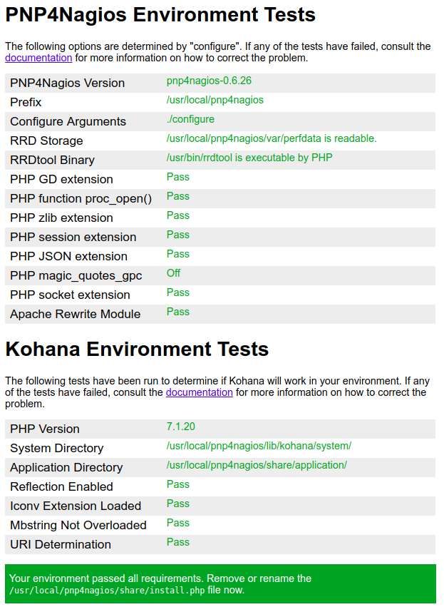
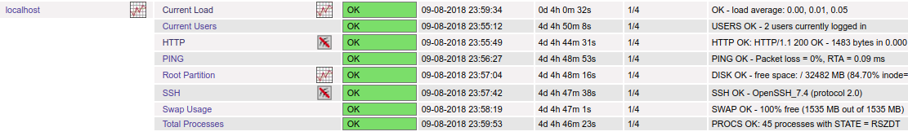
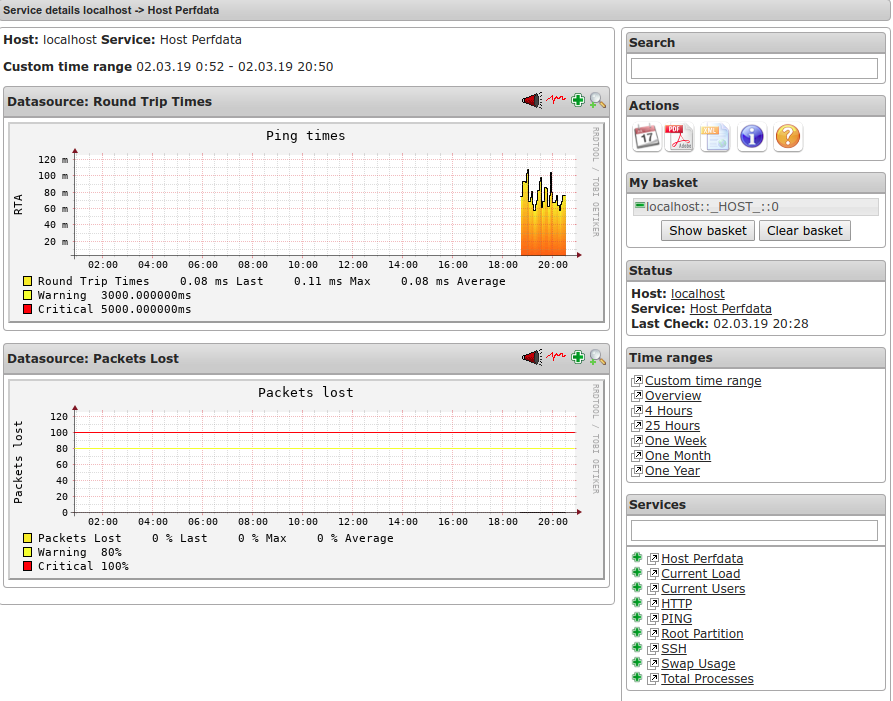

# PNP4Nagios

PNP4Nagios là một Nagios addon mà dùng để phần tích performance data được cung cấp bởi các plugins và lưu tự động vào RRD.

Một số tính năng của PNP4Nagios:

- Webfrontend based on Kohana

- Webfrontend based on jQuery Themes

- Javascript-functions using jQuery plugins

- process_perfdata.pl will be able to use one RRD database per datasource

- improved installer. Specification of directory layouts using --with-layout

- RRDtool errors are now displayed as images. no more missing images

- PNP templates cannot overwrite internal variables anymore

- PDF functions recoded

- Template default.php optimized

- Export from RRD databases into XML, CSV and JSON format using the RRDtool “xport” function

- Page functions recoded

- Error pages links to online FAQ

- Mouseover Popup in Nagios frontend via jQuery.clueTip plugin

- Full support of rrdcached

## Về PNP4Nagios


## Cài đặt PNP4Nagios

**Step1**: Cài đặt một số tools yêu cầu

PNP4Nagios yêu cầu công cụ xuất đồ họa `rrdtool`, sử dụng perl để chạy

Thực hiện cài đặt trên CentOS 7

`yum install rrdtool perl-Time-HiRes rrdtool-perl glib2 php-gd`

Nếu sử dụng php7 thì cài đặt như sau:

`yum install rrdtool perl-Time-HiRes rrdtool-perl glib2 php71w-gd`

**Step2**: Download

Download latest version at: [https://sourceforge.net/projects/pnp4nagios/files/latest](https://sourceforge.net/projects/pnp4nagios/files/latest)

Hiện tại phiên bản latest là: `pnp4nagios-0.6.26`

```
wget https://nchc.dl.sourceforge.net/project/pnp4nagios/PNP-0.6/pnp4nagios-0.6.26.tar.gz
tar zxvf pnp4nagios-0.6.26.tar.gz
cd pnp4nagios-0.6.26
```

**Step3**: Thực hiện cài đặt

```
./configure
make all
make fullinstall
```

Nếu cấu hình `./configure` không nhận ra đường dẫn công cụ `rrdtool` khi đó chúng ta cấu hình như sau:

`./configure --with-nagios-user=nagios --with-nagios-group=nagios --with-rrdtool=/usr/bin/rrdtool`

Note: `make fullinstall =  make install +  make install-webconf +  make install-config + make install-init`

Trong đó:

- `make install` dùng để biên dịch gói cài đặt ( gồm cài chương trình và tệp tin html)

- `make install-webconf` dùng cài đặt tệp cấu hình Apache cho PNP4Nagios

- `make install-config` dùng để  cài đặt tệp cấu hình (copy thư viện process_perfdata.pl và tệp bin npcd vào các thư mục con của pnp4nagios)

- `make install-init` dùng để cài đặt PNP4Nagios như Service / Daemon

```
./configure --with-nagios-user=nagios --with-nagios-group=nagios --with-rrdtool=/usr/bin/rrdtool
make all
make install
make install-webconf
make install-config
make install-init
```

Kiểm tra các môi trường cho PNP4Nagios để xác định xem đã pass chưa

<p align="center"> 

</p>

Sau khi kiểm tra môi trường đã pass, chúng ta sẽ gỡ tệp `install.php` của pnp4nagisos

`rm -f /usr/local/pnp4nagios/share/install.php`

## Cấu hình PNP4Nagios và Nagios

PNP4Nagios hỗ trợ 04 chế độ cấu hình: Synchronous, Bulk, Bulk Mode with NPCD, Bulk Mode with NPCD and npcdmod. Tham khảo thêm [https://docs.pnp4nagios.org/pnp-0.6/config](https://docs.pnp4nagios.org/pnp-0.6/config)

Trong bài này chúng ta thực hiện cấu hình PNP4Nagios trong chế độ `Bulk Mode with NPCD` (NPCD = Nagios-Perfdata-C-Daemon)

Trong chế  độ `Bulk with NPCD`, Nagios ghi dữ liệu vào một tệp tạm thời ở định dạng xác định. Các tệp tin tạm thời được đưa vào thư mục tạm thời. Daemon `NPCD` thực hiện giám sát toàn thư mục chứa các tệp tin tạm thời đó và chuyển đến `process_perfdata.pl` để xử lý vùng thư mục đó theo khoảng thời gian nhất định. Tiếp đó công cụ `rrdtool` thực hiện việc xử lý đồ họa dựa trên các tệp tin mà lệnh `process_perfdata.pl` đã xử lý. Cuối cùng dữ liệu sẽ được xuất sang tệp định dạng XML metadata

**Step1**: Cấu hình xử lý performance data

Sửa tệp `/usr/local/nagios/etc/nagios.cfg` với nội dung sau:

process_performance_data=1 ; default = 0

và thêm các nội dung sau:

```
#service performance data

service_perfdata_file=/usr/local/pnp4nagios/var/service-perfdata
service_perfdata_file_template=DATATYPE::SERVICEPERFDATA\tTIMET::$TIMET$\tHOSTNAME::$HOSTNAME$\tSERVICEDESC::$SERVICEDESC$\tSERVICEPERFDATA::$SERVICEPERFDATA$\tSERVICECHECKCOMMAND::$SERVICECHECKCOMMAND$\tHOSTSTATE::$HOSTSTATE$\tHOSTSTATETYPE::$HOSTSTATETYPE$\tSERVICESTATE::$SERVICESTATE$\tSERVICESTATETYPE::$SERVICESTATETYPE$
service_perfdata_file_mode=a
service_perfdata_file_processing_interval=15
service_perfdata_file_processing_command=process-service-perfdata-file

#host performance data starting with Nagios
 
host_perfdata_file=/usr/local/pnp4nagios/var/host-perfdata
host_perfdata_file_template=DATATYPE::HOSTPERFDATA\tTIMET::$TIMET$\tHOSTNAME::$HOSTNAME$\tHOSTPERFDATA::$HOSTPERFDATA$\tHOSTCHECKCOMMAND::$HOSTCHECKCOMMAND$\tHOSTSTATE::$HOSTSTATE$\tHOSTSTATETYPE::$HOSTSTATETYPE$
host_perfdata_file_mode=a
host_perfdata_file_processing_interval=15
host_perfdata_file_processing_command=process-host-perfdata-file
```

Trong đó:

- service_perfdata_file : chỉ định đường dẫn chứa các tệp tin tạm thời mà chứa performance data

- service_perfdata_file_template : Định nghĩa định dạng kiểu dữ liệu sẽ sử dụng Nagios macros

- service_perfdata_file_mode=a : Tùy chọn “a” dùng chỉ định để mở rộng tệp tin (append)

- service_perfdata_file_processing_interval : Khoảng thời gian xử lý mỗi tệp tin

- service_perfdata_file_processing_command : Chỉ định command xử lý được gọi trong suốt khoảng thời gian trên

Tương tự như vậy với các chỉ thị với performance data cho host

**Step2**: Định nghĩa command performance data trong Nagios

Thực hiện định nghĩa command trong tệp tin để xử lý performance data

Thêm vào cuối tệp tin `/usr/local/nagios/etc/objects/commands.cfg` với nội dung sau:

```
#PERFORMANCE DATA COMMANDS with PNP4Nagios
define command{
       command_name    process-service-perfdata-file
       command_line    /bin/mv /usr/local/pnp4nagios/var/service-perfdata /usr/local/pnp4nagios/var/spool/service-perfdata.$TIMET$
}

define command{
       command_name    process-host-perfdata-file
       command_line    /bin/mv /usr/local/pnp4nagios/var/host-perfdata /usr/local/pnp4nagios/var/spool/host-perfdata.$TIMET$
}
```
Macro **$TIMET$** được thêm vào tên tệp để tránh việc ghi đè các tệp cũ không chủ đích

**Step3**: Định nghĩa templates

Khi muốn sử dụng phần action URL từ Nagios đến PNP4Nagios chúng ta phải thêm các chỉ thị kiểu như:

`action_url /pnp4nagios/index.php/graph?host=$HOSTNAME$&srv=_HOST_' class='tips' rel='/pnp4nagios/index.php/popup?host=$HOSTNAME$&srv=_HOST_` 

hay

`action_url /pnp4nagios/index.php/graph?host=$HOSTNAME$&srv=$SERVICEDESC$' class='tips' rel='/pnp4nagios/index.php/popup?host=$HOSTNAME$&srv=$SERVICEDESC$`. 

Khi đó với số lượng lớn host và rất nhiều các services, chúng ta sẽ cảm thấy mỗi lần thêm chỉ thị dài vậy thật phức tạp. Vì vậy mà chúng ta thực hiện định nghĩa phần action URL đến dạng đơn giản hơn. Thực hiện như sau:

Thêm nội dung sau vào cuối tệp tin `/usr/local/nagios/etc/objects/templates.cfg`

```
#PNP4Nagios
define host {
   name       host-pnp
   action_url /pnp4nagios/index.php/graph?host=$HOSTNAME$&srv=_HOST_' class='tips' rel='/pnp4nagios/index.php/popup?host=$HOSTNAME$&srv=_HOST_
   register   0
}

define service {
   name       srv-pnp
   action_url /pnp4nagios/index.php/graph?host=$HOSTNAME$&srv=$SERVICEDESC$' class='tips' rel='/pnp4nagios/index.php/popup?host=$HOSTNAME$&srv=$SERVICEDESC$
   register   0
}
```

**Step4**: Định nghĩa host giám sát kết hợp PNP4Nagios

Với các host đã định nghĩa cho giám sát, để thực hiện action URL từ Nagios đến PNP4Nagios, chúng ta thêm template `host-pnp` hoặc `srv-pnp` vào chỉ thị `use` trong phần định nghĩa host hoặc service

Ví dụ thêm vào trong phần giám sát cho `localhost` như sau:

```
# HOST DEFINITION

# Define a host for the local machine
define host {
    use                     linux-server,host-pnp            ; Name of host template to use
                                                    ; This host definition will inherit all variables that are defined
                                                    ; in (or inherited by) the linux-server host template definition.
    #action_url /pnp4nagios/index.php/graph?host=$HOSTNAME$&srv=_HOST_' class='tips' rel='/pnp4nagios/index.php/popup?host=$HOSTNAME$&srv=_HOST_
    host_name               localhost
    alias                   localhost
    address                 127.0.0.1
}

# SERVICE DEFINITIONS

# Define a service to "ping" the local machine
define service {
    use                     local-service           ; Name of service template to use
    host_name               localhost
    service_description     PING
    check_command           check_ping!100.0,20%!500.0,60%
}

# Define a service to check the disk space of the root partition
# on the local machine.  Warning if < 20% free, critical if
# < 10% free space on partition.

define service {
    use                     local-service,srv-pnp           ; Name of service template to use
    host_name               localhost
    service_description     Root Partition
    check_command           check_local_disk!20%!10%!/
```

**Step4**: Kiểm tra dữ liệu đồ họa

Thực hiện restart nagios

`systemctl restart nagios`

Và thực hiện truy cập giao diện web nagios kiểm tra

<p align="center"> 

</p>

<p align="center"> 

</p>

Tham khảo: [https://docs.pnp4nagios.org/pnp-0.6/start](https://docs.pnp4nagios.org/pnp-0.6/start)
