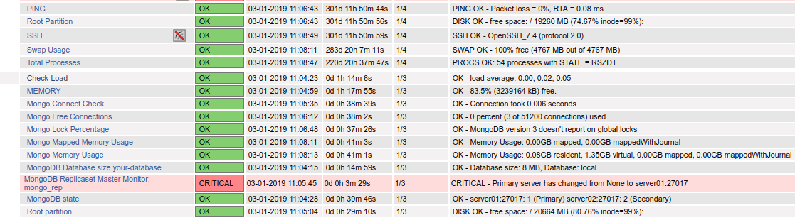
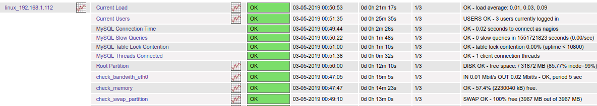

# Cài đặt và cấu hình một số  extended plugin

## 1. MongoDB

Thực hiện cấu hình trên Nagios server

Download plugin mongodb tại: [https://github.com/mzupan/nagios-plugin-mongodb](https://github.com/mzupan/nagios-plugin-mongodb)

Thực hiện các bước sau để thiết lập mongodb plugin

**Step1**: Download plugin mongodb

```
cd /usr/local/nagios/libexec
wget https://raw.githubusercontent.com/mzupan/nagios-plugin-mongodb/master/check_mongodb.py
chmod +x check_mongodb.py
```

**Step2**: Cài đặt thư viện python cho plugin mongodb

```
wget https://raw.githubusercontent.com/mzupan/nagios-plugin-mongodb/master/requirements
pip install -r requirements
```

**Step3**: Định nghĩa command để check mongo

Thêm nội dung sau vào tệp tin /usr/local/nagios/etc/objects/commands.cfg

```
define command {
    command_name    check_mongodb
    command_line    $USER1$/check_mongodb.py -H $HOSTADDRESS$ -A $ARG1$ -P $ARG2$ -W $ARG3$ -C $ARG4$
}

define command {
    command_name    check_mongodb_database
    command_line    $USER1$/check_mongodb.py -H $HOSTADDRESS$ -A $ARG1$ -P $ARG2$ -W $ARG3$ -C $ARG4$ -d $ARG5$
}

define command {
    command_name    check_mongodb_collection
    command_line    $USER1$/check_mongodb.py -H $HOSTADDRESS$ -A $ARG1$ -P $ARG2$ -W $ARG3$ -C $ARG4$ -d $ARG5$ -c $ARG6$
}

define command {
    command_name    check_mongodb_replicaset
    command_line    $USER1$/check_mongodb.py -H $HOSTADDRESS$ -A $ARG1$ -P $ARG2$ -W $ARG3$ -C $ARG4$ -r $ARG5$
}

define command {
    command_name    check_mongodb_query
    command_line    $USER1$/check_mongodb.py -H $HOSTADDRESS$ -A $ARG1$ -P $ARG2$ -W $ARG3$ -C $ARG4$ -q $ARG5$
}
```

```
**Step4**: Định nghĩa các service mongodb

Định nghĩa một số service cần monitor trong tệp cấu hình dành cho Linux (ví dụ tệp linux_192.168.10.111.cfg)

Thêm nội dung sau vào tệp /usr/local/nagios/etc/servers/linux_192.168.10.111.cfg

```
#Check Connection
define service {
    use                 generic-service
    host_name  	        linux_192.168.10.111
    service_description Mongo Connect Check
    check_command       check_mongodb!connect!27017!2!4
}
#Check Percentage of Open Connections
define service {
    use                 generic-service
    host_name  	        linux_192.168.10.111
    service_description Mongo Free Connections
    check_command       check_mongodb!connections!27017!70!80
}

#Check Memory Usage
define service {
    use                 generic-service
    host_name	        linux_192.168.10.111
    service_description Mongo Memory Usage
    check_command       check_mongodb!memory!27017!20!28
}

#Check Mapped Memory Usage
define service {
    use                 generic-service
    host_name	        linux_192.168.10.111
    service_description Mongo Mapped Memory Usage
    check_command       check_mongodb!memory_mapped!27017!20!28
}

#Check Lock Time Percentage
define service {
    use                 generic-service
    host_name	        linux_192.168.10.111
    service_description Mongo Lock Percentage
    check_command       check_mongodb!lock!27017!5!10
}

#Check status of mongodb replicaset
define service {
    use                 generic-service
    host_name		linux_192.168.10.111
    service_description MongoDB replicaset state
    check_command       check_mongodb!replset_state!27017!0!0
}

#Check size of a database
define service {
    use                 generic-service
    host_name	        linux_192.168.10.111
    service_description MongoDB Database size your-database
    check_command       check_mongodb_database!database_size!27017!300!500!your-db
}

#Check the primary server of replicaset
define service {
    use                 generic-service
    host_name	        linux_192.168.10.111
    service_description Replicaset Master: your-replSetName
    check_command       check_mongodb_replicaset!replica_primary!27017!0!1!your-replicaset
}
```
**Step5**: Kiểm tra nagios web

- Restart nagios

`systemctl restart nagios`

- Check giám sát

<p align="center">

</p>

Ta thấy kiểm tra trạng thái replica của primary thì hiện tại server đang là secondary và primary nằm trên server01:27017

## 2. MySQL/MariaDB

### 2.1 Cấu hình trên Mysql/MariaDB server

Cho rằng MySQL/MariaDB server có địa chỉ IP là 192.168.1.112

**Step1**: Gán quyền truy cập mysql/mariadb

Chúng ta thực hiện gán người dùng `nagios` với quyền `usage`

```
[root@node02 libexec]# mysql -u root -p
Enter password: 
Welcome to the MariaDB monitor.  Commands end with ; or \g.
Your MariaDB connection id is 68
Server version: 5.5.60-MariaDB MariaDB Server

Copyright (c) 2000, 2018, Oracle, MariaDB Corporation Ab and others.

Type 'help;' or '\h' for help. Type '\c' to clear the current input statement.

MariaDB [(none)]> grant usage on *.* to nagios@192.168.1.112 identified by 'P@ssword';
Query OK, 0 rows affected (0.00 sec)

MariaDB [(none)]> flush privileges;
Query OK, 0 rows affected (0.00 sec)

MariaDB [(none)]> 
```

**Step2**: Download check_mysql_health 

```
wget https://labs.consol.de/assets/downloads/nagios/check_mysql_health-2.2.2.tar.gz 
tar zxvf check_mysql_health-2.2.2.tar.gz 
cd check_mysql_health-2.2.2
./configure
make
make install
```

Khi đó check thư mục /usr/local/nagios/libexec, chúng ta sẽ thấy plugin `check_mysql_health`

Có thể download tại: [check_mysql_health](https://github.com/keepwalking86/nagios-core-4x/blob/master/libexec/check_mysql_health)

**Step3**: Định nghĩa các service trên nrpe

Thực hiện thêm nội dung sau vào tệp **/usr/local/nagios/etc/nrpe.cfg**

```
command[check_mysql_slow_queries]=/usr/local/nagios/libexec/check_mysql_health --hostname 192.168.1.112 --port=3306 --username nagios --password P@ssw0rd --mode slow-queries
command[check_mysql_connection_time]=/usr/local/nagios/libexec/check_mysql_health --hostname 192.168.1.112 --port=3306 --username nagios --password P@ssw0rd --mode connection-time
command[check_mysql_threads_connected]=/usr/local/nagios/libexec/check_mysql_health --hostname 192.168.1.112 --port=3306 --username nagios --password P@ssw0rd --mode threads-connected
command[check_mysql_table_lock_contention]=/usr/local/nagios/libexec/check_mysql_health --hostname 192.168.1.112 --port=3306 --username nagios --password P@ssw0rd --mode table-lock-contention
```

Ngoài một số mode ở trên, chúng ta có thể thêm một số mode sau cho check_mysql_health

- connection-time (Time to connect to the server) 

- uptime (Time the server is running) 

- threads-connected (Number of currently open connections) 

- threadcache-hitrate (Hit rate of the thread-cache) 

- slave-lag (Seconds behind master) 

- slave-io-running (Slave io running: Yes) 

- slave-sql-running (Slave sql running: Yes) 

- qcache-hitrate (Query cache hitrate)

- qcache-lowmem-prunes (Query cache entries pruned because of low memory) 

- keycache-hitrate (MyISAM key cache hitrate) 

- bufferpool-hitrate (InnoDB buffer pool hitrate)

- bufferpool-wait-free (InnoDB buffer pool waits for clean page available) 

- log-waits (InnoDB log waits because of a too small log buffer) 

- tablecache-hitrate (Table cache hitrate) 

- table-lock-contention (Table lock contention) 

- index-usage (Usage of indices) 

- tmp-disk-tables (Percent of temp tables created on disk) 

- slow-queries (Slow queries) 

- long-running-procs (long running processes)

- cluster-ndbd-running (ndnd nodes are up and running)

- sql (any sql command returning a single number)

### 2.2 Cấu hình trên Nagios server

**Step1**: Định nghĩa host giám sát

Thêm nội dung sau vào tệp cấu hình `etc/servers/linux_192.168.1.112.cfg` cho giám sát host 192.168.1.112

```
##Check MySQL/MariaDB
define service{
        use                     generic-service
        host_name               linux_192.168.1.112
        contact_groups          admins
        service_description     MySQL Connection Time
        check_command           check_nrpe!check_mysql_connection_time
}
define service{
        use                     generic-service
        host_name               linux_192.168.1.112
        contact_groups          admins
        service_description     MySQL Slow Queries
        check_command           check_nrpe!check_mysql_slow_queries
}
define service{
        use                     generic-service
        host_name               linux_192.168.1.112
        contact_groups          admins
        service_description     MySQL Table Lock Contention
        check_command           check_nrpe!check_mysql_table_lock_contention
}
define service{
        use                     generic-service
        host_name               linux_192.168.1.112
        contact_groups          admins
        service_description     MySQL Threads Connected
        check_command           check_nrpe!check_mysql_threads_connected
}

```
**Step2**: Kiểm tra nagios web

- Restart nagios

`systemctl restart nagios`

- Check giám sát

<p align="center">

</p>

**Read more**

[https://mariadb.com/resources/blog/advanced-mariadb-monitoring-with-nagios/](https://mariadb.com/resources/blog/advanced-mariadb-monitoring-with-nagios/)

[https://labs.consol.de/nagios/check_mysql_health/](https://labs.consol.de/nagios/check_mysql_health/)

## 3. RabbitMQ

